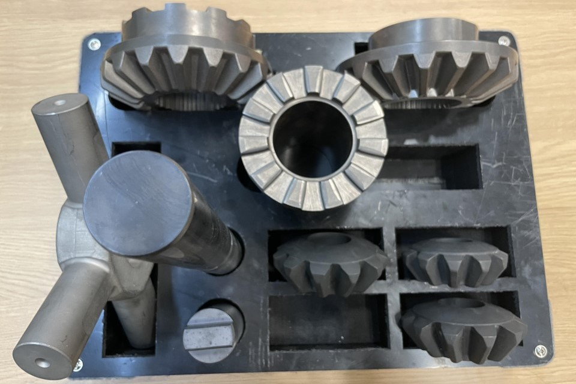

# Domain Randomization for Object Detection in Manufacturing Applications using Synthetic Data: A Comprehensive Study

This code generates synthetic data from 3D models using domain randomization.   
We use two datasets to generate synthetic images and train an object detection model, which performs well on real-world data.  
1. **Robotic Dataset**: Published by [Horváth et al.](https://ieeexplore.ieee.org/document/9916581), which provides both 3D models and real images.
2.  **SIP15-OD Dataset**: Developed by us. It contains 15 manufacturing object 3D models across three use cases, along with 395 real images featuring 996 annotated objects taken in various manufacturing environments.   
Below are samples of the synthetic data and their real-world counterparts from the robotic dataset, as well as the three use cases from the SIP-15-OD dataset.  

<table>
  <tr>
    <td></td>
    <td></td>
    <td></td>
    <td></td>
  </tr>
  <tr>
    <td></td>
    <td></td>
    <td></td>
    <td></td>
  </tr>
</table>


## Setup Python environment

1. Setup conda environment using `conda env create -f environment.yml`
2. Activate environment using `conda activate SynMfg_Code`

## Setup Blender

### Download Blender 3.4
1. Go to [Blender 3.4](https://download.blender.org/release/Blender3.4/), and download the appropriate version of Blender for your system. As an example `blender-3.4.1-windows-x64.msi` for Windows or `blender-3.4.1-linux-x64.tar.xz` for Linux.
2. Install Blender.
3. Set blender environment variable `BLENDER_PATH` to the Blender executable. As an example `C:\Program Files\Blender Foundation\Blender 3.4\blender.exe` for Windows or `/user/blender-3.4.1-linux-x64/blender` for Linux.

## Setup Texture folders

Downloaded textures are put into their corresponding folders inside the `data` folder structure.
```
SynMfg_Code/
└── data/
    ├── Background_Images/
    ├── Objects/
    ├── PBR_Textures/
    └── Texture_Images/
```
### Download background images
1. Go to [Google Drive](https://drive.google.com/drive/folders/1ZBaMJxZtUNHIuGj8D8v3B9Adn8dbHwSS).
2. Download all image files from **train** and **testval** folders. 
3. Put all images into `data/Background_Images`.

### Download texture images
1. Go to [Flickr 8k Dataset](https://www.kaggle.com/datasets/adityajn105/flickr8k/).
2. Download all image files.
3. Put all images into `data/Texture_Images`.

### Download PBR textures
1. Run `blenderproc download cc_textures data/PBR_Textures`. It downloads textures from [cc0textures.com](https://cc0textures.com).
2. To use specific material textures like metal, create a new folder named `data/Metal_Textures` and place only the metal textures from the `cc_textures` data there.

## 3D model preparation

The 3D models in .obj format of the first robotic dataset are already included in `data/Objects/Robotic`. The 3D models of the SIP15-OD datasets are coming soon.   
To prepare other 3D models for use with the pipeline efficiently they should follow these criteria:

1. .obj format. The pipeline **ONLY** handles .obj files.
2. The different 3d models should be scaled proportionally to eachother and the models needs to be centered in world space.
3. No overlapping vertices. If a model contains overlapping vertices parts of the pipeline will run inefficiently and automatic texture mapping will be less successful.
To mitigate this Blender's `Merge vertices` function can be used to remove overlapping vertices. 

## Configuration file

Our data generation pipeline considers five components of DR: object characteristics, background, illumination, camera settings, and post-processing. The range of random settings for these components is defined in the config-sample.json file. To customize these settings, copy the sample configuration file and make the necessary changes. Once the desired parameters are set, the pipeline generates synthetic data accordingly. The parameters specified in the configuration file for the five DR components and rendering are detailed in the table below:  

| Parameter                       | Description                                                                                       | Value                                |
|---------------------------------|---------------------------------------------------------------------------------------------------|--------------------------------------|
| **Background**                                                                                                                                                             |
| background_texture_type         | Type of texture: 1: no texture; 2: Random images from the BG-20L dataset.                         | 2                                    |
| total_distracting_objects       | Maximum number of distractors in the scene.                                                       | 10                                   |
| **Object**                      |                                                                                                   |                                      |
| max_objects                     | Maximum number of objects; Set to -1 includes all objects and empty background images.            | -1                                   |
| multiple_of_same_object         | Allow multiple instances of the same object in one scene.                                         | TRUE                                 |
| object_weights                  | Weights for object categories; [] for equal distribution.                                         | []                                   |
| nr_objects_weights              | Weights for the number of objects; [] for equal distribution.                                     | []                                   |
| object_rotation_x_min           | Min x-axis rotation angle for objects.                                                            | 0                                    |
| object_rotation_x_max           | Max x-axis rotation angle for objects.                                                            | 360                                  |
| object_rotation_y_min           | Min y-axis rotation angle for objects.                                                            | 0                                    |
| object_rotation_y_max           | Max y-axis rotation angle for objects.                                                            | 360                                  |
| object_distance_scale_min       | Min ratio of distance between objects; Set to 0.53 to prevents overlap.                           | 0.53                                 |
| object_distance_scale_max       | Max ratio of distance between objects.                                                            | 1                                    |
| objects_texture_type            | Type of textures: 1: RGB; 2: image; 3: PBR materials; 0: random.                                  | 3                                    |
| **Camera**                      |                                                                                                   |                                      |
| camera_zoom_min                 | Minimum zoom level of the camera.                                                                 | 0.1                                  |
| camera_zoom_max                 | Maximum zoom level of the camera.                                                                 | 0.7                                  |
| camera_theta_min                | Minimum azimuthal angle of the camera.                                                            | 0                                    |
| camera_theta_max                | Maximum azimuthal angle of the camera.                                                            | 360                                  |
| camera_phi_min                  | Minimum polar angle of the camera.                                                                | 0                                    |
| camera_phi_max                  | Maximum polar angle of the camera. Max: 90 degrees.                                                | 60                                   |
| camera_focus_point_x_shift_min  | Min shift in the x-direction for the camera focus point.                                          | 0                                    |
| camera_focus_point_x_shift_max  | Max shift in the x-direction for the camera focus point.                                          | 0.5                                  |
| camera_focus_point_y_shift_min  | Min shift in the y-direction for the camera focus point.                                          | 0                                    |
| camera_focus_point_y_shift_max  | Max shift in the y-direction for the camera focus point.                                          | 0.5                                  |
| camera_focus_point_z_shift_min  | Min shift in the z-direction for the camera focus point.                                          | 0                                    |
| camera_focus_point_z_shift_max  | Max shift in the z-direction for the camera focus point.                                          | 0.5                                  |
| **Illumination**                |                                                                                                   |                                      |
| light_count_auto                | Auto set light count based on scene size.                                                         | 1                                    |
| light_count_min                 | Min number of lights (when light_count_auto = 0).                                                 | 0                                    |
| light_count_max                 | Max number of lights (when light_count_auto = 0).                                                 | 0                                    |
| light_energy_min                | Min energy level of the lights.                                                                   | 5                                    |
| light_energy_max                | Max energy level of the lights.                                                                   | 150                                  |
| light_color_red_min             | Min red color value of the lights.                                                                | 0                                    |
| light_color_red_max             | Max red color value of the lights.                                                                | 255                                  |
| light_color_green_min           | Min green color value of the lights.                                                              | 0                                    |
| light_color_green_max           | Max green color value of the lights.                                                              | 255                                  |
| light_color_blue_min            | Min blue color value of the lights.                                                               | 0                                    |
| light_color_blue_max            | Max blue color value of the lights.                                                               | 255                                  |
| **Post-processing**             |                                                                                                   |                                      |
| image_sp_noise_probability      | Probability of applying salt-and-pepper noise (0-1).                                              | 0.1                                  |
| image_sp_noise_amount_min       | Min amount of salt-and-pepper noise.                                                              | 0.01                                 |
| image_sp_noise_amount_max       | Max amount of salt-and-pepper noise.                                                              | 0.05                                 |
| image_gaussian_blur_probability | Probability of applying Gaussian blur (0-1).                                                      | 0.1                                  |
| image_gaussian_blur_sigma_min   | Min sigma value for Gaussian blur.                                                                | 1                                    |
| image_gaussian_blur_sigma_max   | Max sigma value for Gaussian blur.                                                                | 3                                    |
| **Rendering**                   |                                                                                                   |                                      |
| generate_nr_samples             | Total number of synthetic images to generate.                                                     | 4000                                 |
| nr_blender_instances            | Number of blender instances to run.                                                               | 10                                   |
| render_image_width              | Width of the rendered image.                                                                      | 720                                  |
| render_image_height             | Height of the rendered image.                                                                     | 720                                  |
| render_image_format             | Format of the rendered image (PNG or JPEG).                                                       | PNG                                  |
| background_samples              | Include background images without objects.                                                        | TRUE                                 |
| segmentations                   | Whether to generate segmentation mask annotations.                                                | TRUE                                 |
| clean_paths                     | If true, start rendering anew; if false, continue from previous.                                  | TRUE                                 |
| object_label                    | Labels of the 3D objects.                                                                         | {"0": "L-bracket.obj", "1": "U-bracket.obj", etc.} |  

Unless otherwise specified, the ranges are as follows: angles (0 to 360 degrees), ratios (0 to 1), colors (0 to 255), and other numbers (0 to unlimited).  

## Running the pipeline

Run `python generation_main.py --config config-sample.json` to start the generation.

## Training Yolov8 model  

After generating synthetic data, train the YOLOv8 model by following the instructions on the official Ultralytics GitHub repository ([YOLOv8 GitHub](https://github.com/ultralytics/ultralytics)) and evaluate its performance on real images.


## Acknowledgement
The robotic dataset is from Horváth et al., including their .obj files and real images accessed from their [GitLab repository](https://git.sztaki.hu/emi/sim2real-object-detection/-/tree/master). Thanks for their great work!

We also thank previous works in domain randomization for industrial applications, including [Tobin et al.](https://ieeexplore.ieee.org/document/8202133), [Eversberg and Lambrecht](https://www.mdpi.com/1424-8220/21/23/7901), and [Horváth et al.](https://ieeexplore.ieee.org/document/9916581).

We acknowledge the contributions of the YOLOv8 model from Ultralytics, which we used for training our model.

<!--
## Citation 
If you find our work helpful for your research, please consider citing the following BibTeX entry.

To be added.
-->

