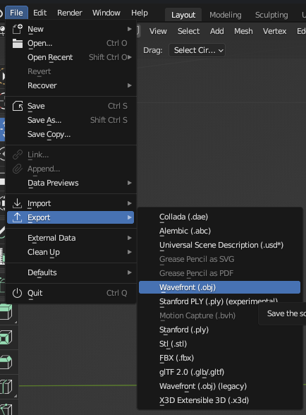

# Configuring OBJ Files for the Pipeline

The pipeline reads only `.obj` files. All files used for generation must be located within a single folder, specified 
in the [config file](../../config-sample.json). 

The 3D models in .obj format of the first robotic dataset are already included in `data/Objects/Robotic`. The 3D models of the SIP15-OD datasets are coming soon.   
To prepare other 3D models for use with the pipeline efficiently they should follow these criteria:

1. `.obj` format. The pipeline **ONLY** handles `.obj` files.
2. The different 3d models should be scaled proportionally to eachother and the models needs to be centered in world space.
3. No overlapping vertices. If a model contains overlapping vertices parts of the pipeline will run inefficiently and automatic texture mapping will be less successful.
To mitigate this Blender's `Merge vertices` function can be used to remove overlapping vertices. 
4. The objects contained in these files must also be listed in the
[config file](../../config-sample.json) under the `object_label` feild, with their corresponding integer labels, e.g.,
`{"L-Bracket": "0", "U-Bracket": "1", "Angle_Bracket": "2",...}`.
5. The objects contained in a `.obj` file needs to adhere to the format described below in "Checking and changing name of objects".
This is true for `.obj` files containing single and multiple objects.

## Importing .glb files and exporting them as .obj

If you want to convert `.glb` files to `.obj` using Blender:

1. Go to `File->Import->glTF 2.0`:

2. After selecting the file, change the import settings to `Merge Vertices` and change shading to `Flat Shading`: 

3. After the object is imported into the scene, select it and go to `File->Export->Wavefront(.obj)`:

4. After selecting the file, **uncheck** the settings `Selected Only` and `Materials -> Export`

## Fixing object in Blender with overlapping vertices.

1. Identify the problem by trying to move a vertex. If there are overlapping non-connected vertices the faces of the model
will not move together, and it will look something like this when trying to move a vertex:

<table>
  <tr>
    <td></td>
    <td></td>
    <td></td>
  </tr>
  <tr>
    <td></td>
    <td></td>
    <td></td>
  </tr>
</table>

2. To fix this close vertices needs to be merged into one. 
- Go to `Select->All` (Or press crl+A)
  

- Right-click on the model and select `Merge Vertices->By Distance` 

- A box in the bottom left corner will open where a merge distance can be fine-tuned. The default value is usually good.
But if you see visible vertices merge, lower this value further. Pressing enter or clicking outside this box applies the
merge. 

- Test moving the vertices as described in step 1. If there are still issues try increasing the distance of the merge.
If the merge was successful then the faces of the model should move together when a common vertex is moved. 

- To export the fixed model follow steps 3-4 in the "Importing .glb files" section.

## Checking and changing name of objects

The code will automatically verify if all objects in the provided `.obj` files are included in the `object_label` field 
in the [config file](../../config-sample.json).
If an object in the `.obj` files is found without a corresponding label, an error will be displayed. 
Object names can be checked and adjusted using Blender. 

If a `.obj` file contains multiple instances of an object, such as the earlier example Panel_Screws.obj with multiple
`Screw` objects, they must follow this format: `LABEL.XXX`, 
where LABEL is the object label (e.g. "Screw") and X are integers. 
For instance, the objects would be named Screw.001, Screw.002, Screw.003.

To view the object names, import the file into Blender and look at the Outliner:

The top name represents the object name, while the bottom shows the mesh name. 
In this example, both names are incorrect and must be changed to match the object name, "Angele_Bracket" in the default 
[config file](../../config-sample.json). Double-click the names to edit them:

## .obj file containing multiple objects example

This system allows the same object to be included in multiple `.obj` files, which is useful for assembled objects
with different variations that consists of smaller components.
For example, a fastened "panel" might use either "screws" or "bolts". These would be represented in files as follows:

- `Panel_Screws.obj` containing `{Panel, Screw.001, Screw.002, Screw.003}`
- `Panel_bolts.obj`  containing `{Panel, Bolt.001, Bolt.002, Bolt.003}`

In total, three classes— `{"Panel":"0", "Screw":"1", "Bolt":"2"}` —would be defined under "object_label" in the
[config file](../../config-sample.json).