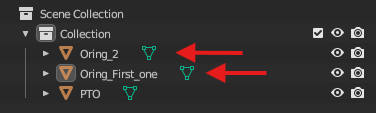
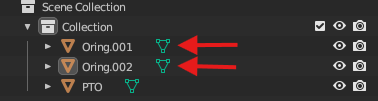

# Configuring OBJ Files for the Pipeline

The pipeline reads only `.obj` files. All files used for generation must be located within a single folder, specified 
in the [config file](../../config-sample.json). The objects contained in these files must also be listed in the
[config file](../../config-sample.json), with their corresponding integer labels, e.g.,
`{"L-Bracket": "0", "U-Bracket": "1", "Angle_Bracket": "2",...}`.

## Example

This system allows the same object to be included in multiple `.obj` files, which is useful for assembled objects
with different variations that consists of smaller components. 
For example, a fastened "panel" might use either "screws" or "bolts". These would be represented in files as follows:

- `Panel_Screws.obj` containing `{Panel, Screw.001, Screw.002, Screw.003}`
- `Panel_bolts.obj`  containing `{Panel, Bolt.001, Bolt.002, Bolt.003}`

In total, three classes— `{"Panel":"0", "Screw":"1", "Bolt":"2"}` —would be defined under "object_label" in the
[config file](../../config-sample.json).

## Checking and changing name of objects

The code will automatically verify if all objects in the provided `.obj` files are included in `object_label`. 
If an object is found without a corresponding label, an error will be displayed. 
Object names can be checked and adjusted using Blender. 

If a `.obj` file contains multiple instances of an object, such as the earlier example Panel_Screws.obj with multiple
`Screw` objects, they must follow this format: `LABEL.XXX`, 
where LABEL is the object label (e.g. "Screw") and X are integers. 
For instance, the objects would be named Screw.001, Screw.002, Screw.003.

To view the object names, import the file into Blender and look at the Outliner:

The top name represents the object name, while the bottom shows the mesh name. 
In this example, both names are incorrect and must be changed to match the object name, "Angele_Bracket" in the default 
[config file](../../config-sample.json). Double-click the names to edit them:

